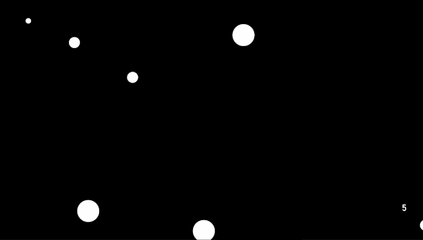

# SMC
  
  

**_[Check out the next version!](https://github.com/Dark-Gran/SMC)_**  
  
This is a FREE game prototype.  
  
  
Does not include JRE and therefore requires Java to run. ([download java](https://www.java.com/en/download/))  
  
**Controls:**
- Game is played with Left Mouse Button / Touch only.
- Extra controls are:  
  - Left/Right Arrow to switch between Levels.
  - R to restart the current Level.
  
[RELEASE DOWNLOAD](https://github.com/Dark-Gran/SaveMeCircles/releases/tag/0.2)  
  
## About Project  
  
The original thought-exercise was to create a gameplay that is:
- "as primitive as possible"
- relaxing (screensaver-based)
- involving circles as main/only actors
- puzzle-like (where player manipulates the environment/level instead of an avatar).  

This led to **version 0.1** (weekend#1):  
- In default, only circles floating around. ("relaxing screensaver", no "avatar")  
- Goal is to merge all circles of the same color.  
- The puzzle part comes from intrinsic values and relations between colors.  
- The player may affect the size and speed of the circles, however direct interaction must remain minimal. (1. to keep the looks and feeling of a relaxing screensaver; 2. to keep the "puzzle-like" feel)  

In other words, the game was meant to be a relaxing experience, playable by people of all ages, where the basic description would be _"there are floating circles, and you can easily touch them to make them smaller/bigger and faster/slower"_.  

After some testing, the game was upgraded to the **current version (0.2)** (weekend#2):  
- Speeds and sizes were changed drastically, as it became very clear that the game easily becomes a "billiard" instead of a puzzle.
- To raise interactivity, the player is allowed to place his own "player-circle" to affect the environment directly. However this ability is (and must remain) limited (not to become an "avatar").
- Trajectory-projection was added because no matter the speeds and sizes (= difficulty), the game will always be about _if_, _where_, and _when_ will two specific circles meet (and what will be the result).
- Basic obstacles were added to illustrate the main gameplay-concept in a combination with classic puzzle-game features (walls, doors and movable walls). The combination ensures that there will always be "new possible original levels" to create (= allows publishing levels continuously).
  
## Known Issues  
  
#### Simulation Stagger  
  
Certain collisions in Box2D engine are performance-heavy. These collisions become heavier because of the way the 'constant' circle speed is being kept in the game (which they keep despite the collisions being resolved by a physics engine that is trying to make them act accordingly to newtonian physics).  
  
**This may become very noticable (the game staggers) when many of these collisions are being simulated to draw trajectories.**  
  
Most of these specific collisions are already being detected (and disabled for simulation), however some are still not (eg. collisions in right-angle corners).  
  
Possible solutions (except for "simulate trajectories imperfectly"):  
a) Detect and disable simulation of the remaining "performance heavy" collisions.  
b) Find or write a different physics engine.

Follow-up edit: The gameplay requires non-newtonian physics, therefore any used engine may be used only for detecting collisions etc. without letting the physics engine to resolve them at all (the resolutions must be custom-made). [See the next version for more.](https://github.com/Dark-Gran/SMC)
  
## Screenshots
  
  
---  
  
---  
  
---  
  
---  
  
  
  
