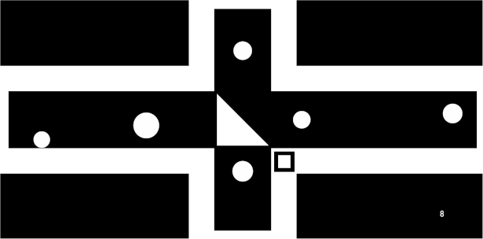
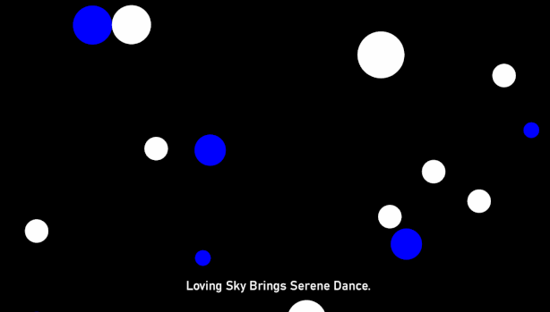
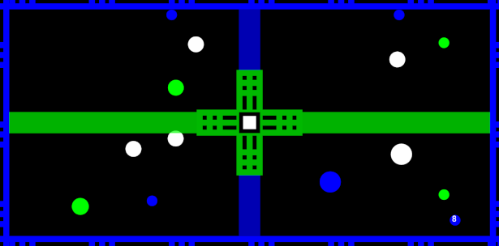

# SaveMeCircles  
  
  
  
This is a FREE game prototype.  
  
[RELEASE DOWNLOAD](https://github.com/Dark-Gran/SaveMeCircles/releases/tag/0.2)  
  
Requires Java 8 to run. ([download java](https://www.java.com/en/download/))  

**Controls:**
- Game is played with Left Mouse Button / Touch only.
- Extra controls are:  
  - Left/Right Arrows switch between Levels.
  - R restarts current Level.
  
  
## About Project  
  
The original thought-exercise was to create a game concept that is:
- "as primitive as possible"
- relaxing (screensaver-based)
- puzzle-like (where player manipulates the environment/level instead of an avatar).  

This led to **version 0.1**:  
- In default, only circles floating around. ("relaxing screensaver", no "avatar")  
- Goal is to merge all circles of the same color.  
- The puzzle part comes from intrinsic values and relations between colors.  
- The player may affect the size and speed of the circles, however direct interaction must remain minimal. (1. to keep the looks and feeling of a relaxing screensaver; 2. to keep the "puzzle-like" feel)  

After some testing, the game was upgraded to the **current version (0.2)**:  
- Speeds and sizes were changed drastically, as it became very clear that the game easily becomes a "billiard" instead of a puzzle.
- To raise interactivity, the player is allowed to place his own "player-circle" to affect the environment directly. However this ability is (and must remain) limited (not to become an "avatar").
- Trajectory-projection was added because no matter the speeds and sizes (= difficulty), the game will always be about _if_, _where_, and _when_ will two specific circles meet.
- Basic obstacles were added to illustrate the main gameplay-concept in a combination with classic puzzle-game features (walls, doors and movable walls). The combination ensures that there will always be "new possible original levels" to create (= allows a business model based on adding levels).
  
  
## Known Issues  
  
The resolution of certain collisions using Box2D physics engine is performance-heavy. These collisions become even heavier because of the way the constant circle speed is being kept.  
  
**This becomes very noticable (the game staggers) when many of these collisions are being simulated to draw trajectories.**  
  
Most of these specific collisions are already being detected (and trajectory calculation is temporarily disabled for these), however some are still not (eg. corner collisions).  
  
Possible solutions (except the "don't calculate trajectories with such perfection"):  
a) Detect and disable simulation of the remaining "performance heavy" collisions.  
b) Find or write a different physics engine. (The circles basically act like massless particles, which means Box2D may not be the best choice for calculating these physics.)  
  
  
## Screenshots
  
  
---  
  
---  
  
---  
  
---  
  
  
  
