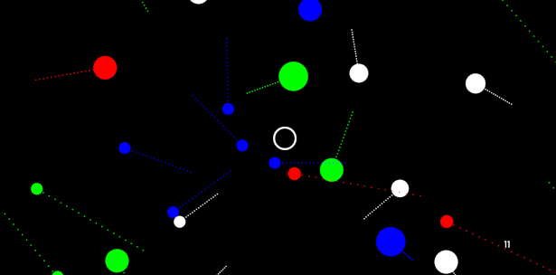

# SaveMeCircles  
  
  
  
This is a FREE game prototype.  
  
[RELEASE DOWNLOAD](https://github.com/Dark-Gran/SaveMeCircles/releases/tag/0.2)  
  
Requires Java 8 to run. ([download java](https://www.java.com/en/download/))  
  
  
## About Project  
  
The original idea was to create a game concept that is "as simple as possible", "relaxing", and "puzzle-like" (where player manipulates the environment/level instead of an avatar).  

This led to **version 0.1**:  
- In default, only circles floating around. ("relaxing screensaver", no "avatar")  
- Goal is to merge all circles of one color.  
- The puzzle part comes from intrinsic values and relations between colors.  
- The player may affect size and speed of the circles, however direct interaction must remain minimal. (1. to keep the feeling of a relaxing screensaver; 2. to keep the "puzzle-like" feel)  

After some testing, the game was upgraded to the current version (**0.2**):  
- Speeds and sizes were changed drastically, as it became very clear that despite the controlled environment, the game becomes a "billiard" instead of a puzzle.
- To raise interactivity, the player is allowed to place his own "player-circle" to affect the environment directly. However this ability is (and must remain) limited (not to become an "avatar").
- Level's containing obstacles...
  
  
## Known Issues  
  
...  
  
  
## Screenshots
  
  
---  
  
---  
  
---  
  
---  
  
  
  
